# TIMER-IP — Timer Management IP Core (APB Interface)

> A fully synthesizable, APB-compliant Timer IP Core designed for SoC integration.  
> Includes RTL schematics, functional verification, simulation waveforms, and full test coverage evidence.

---

## Table of Contents

1. [Project Overview](#1-project-overview)
2. [Repository Structure](#2-repository-structure)
3. [Top-Level Architecture](#3-top-level-architecture)
4. [Module Descriptions](#4-module-descriptions)
   - [APB Interface](#41-apb-interface)
   - [Counter Module](#42-counter-module)
   - [Counter Control Module](#43-counter-control-module)
   - [Register Module](#44-register-module)
5. [RTL Design Details](#5-rtl-design-details)
   - [APB RTL](#51-apb-rtl)
   - [Counter RTL](#52-counter-rtl)
   - [Control RTL](#53-control-rtl)
   - [Register RTL](#54-register-rtl)
   - [Interrupt RTL](#55-interrupt-rtl)
   - [Top-Level RTL](#56-top-level-rtl)
6. [Test Plan](#6-test-plan)
7. [Simulation Results — Testcase](#7-simulation-results--testcase)
8. [Verification Results — Ket Qua](#8-verification-results--ket-qua)
9. [Design Specifications](#9-design-specifications)

---

## 1. Project Overview

**TIMER-IP** is a digital hardware IP core implementing a configurable timer with an **APB (Advanced Peripheral Bus / AMBA 2.0)** slave interface. The design is modular, fully synthesizable in Verilog/VHDL, and verified with a complete testbench suite.

Key capabilities:
- Configurable up/down counting with preset load
- Interrupt generation on overflow, underflow, and compare-match events
- APB-compliant register map for software-driven configuration
- Complete RTL-to-verification documentation

---

## 2. Repository Structure

```
TIMER-IP/
├── README.md                        # This document
├── Testplan (1).xlsx                # Full test plan & coverage tracking
│
├── Top_Module.png                   # Top-level block diagram
├── Counter_Module.png               # Counter block diagram
├── Counter_control_module.png       # Counter control block diagram
├── Register_Module_1.png            # Register block diagram (part 1)
├── Register_Module_2.png            # Register block diagram (part 2)
├── Register_Module_3.png            # Register block diagram (part 3)
│
├── rtl/                             # RTL schematic screenshots (14 images)
│   ├── apb.png                      # APB interface RTL view (1)
│   ├── apb2.png                     # APB interface RTL view (2)
│   ├── counter1.png                 # Counter RTL view (1)
│   ├── counter2.png                 # Counter RTL view (2)
│   ├── ctrl1.png                    # Control logic RTL view (1)
│   ├── ctrl2.png                    # Control logic RTL view (2)
│   ├── interrupt.png                # Interrupt logic RTL view
│   ├── register1.png                # Register RTL view (1)
│   ├── register2.png                # Register RTL view (2)
│   ├── register3.png                # Register RTL view (3)
│   ├── register4.png                # Register RTL view (4)
│   ├── top1.png                     # Top-level RTL view (1)
│   ├── top2.png                     # Top-level RTL view (2)
│   └── top3.png                     # Top-level RTL view (3)
│
├── testcase/                        # Simulation waveform screenshots (56 images)
│   └── Screenshot 2026-01-03 *.png
│
└── Ket qua/                         # Final verification results
    ├── Ket qua coverage.jpg         # Code coverage report
    ├── Screenshot 2025-12-03 190429.png
    ├── Screenshot 2025-12-03 190444.png
    ├── Screenshot 2025-12-03 190823.png
    └── Screenshot 2025-12-19 221253.png
```

---

## 3. Top-Level Architecture

The top-level module integrates all submodules under a single APB slave interface:

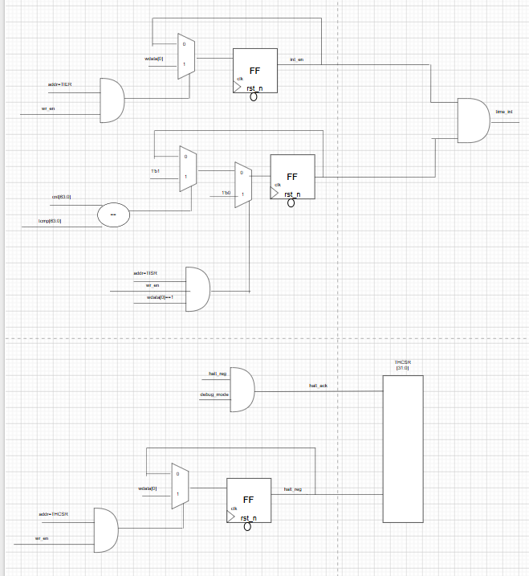

**Top-Level RTL Views:**

| View 1 | View 2 | View 3 |
|--------|--------|--------|
| 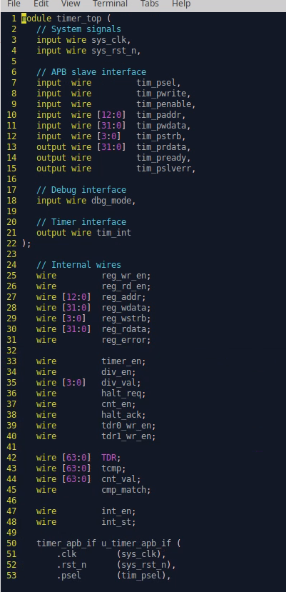 | 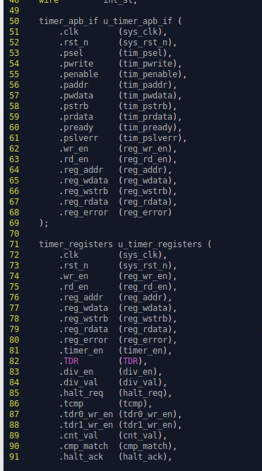 | 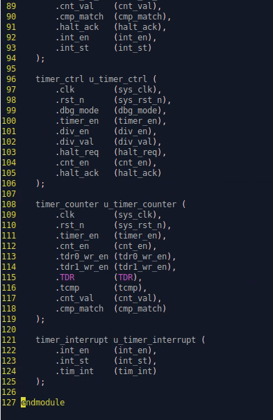 |

---

## 4. Module Descriptions

### 4.1 APB Interface

Implements the AMBA APB 2.0 slave protocol, translating bus transactions into internal register read/write operations.

**Signals:**

| Signal | Direction | Description |
|--------|-----------|-------------|
| PCLK | Input | Bus clock |
| PRESETn | Input | Active-low reset |
| PSEL | Input | Slave select |
| PENABLE | Input | Enable phase |
| PWRITE | Input | Write enable |
| PADDR | Input | Address bus |
| PWDATA | Input | Write data |
| PRDATA | Output | Read data |
| PREADY | Output | Transfer ready |

---

### 4.2 Counter Module

Configurable counter supporting up/down counting, preset load, and overflow/underflow detection.

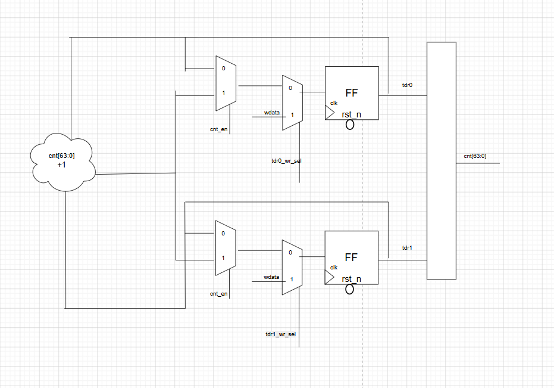

**Features:**
- Programmable count direction (up / down)
- Synchronous preset/load
- Overflow and underflow flags
- Configurable bit-width

---

### 4.3 Counter Control Module

State machine that governs timer operation modes, event handling, and interrupt triggering.


**Responsibilities:**
- Timer start / stop / pause control
- Mode transitions (one-shot, free-run, PWM)
- Compare-match detection
- Interrupt signal generation

---

### 4.4 Register Module

APB-accessible control and status registers for software configuration of the timer.

| View | Image |
|------|-------|
| Register Block (1) | 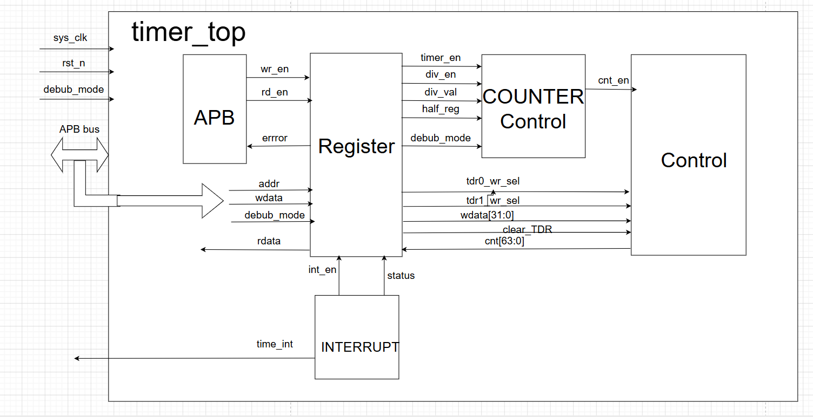 |
| Register Block (2) | 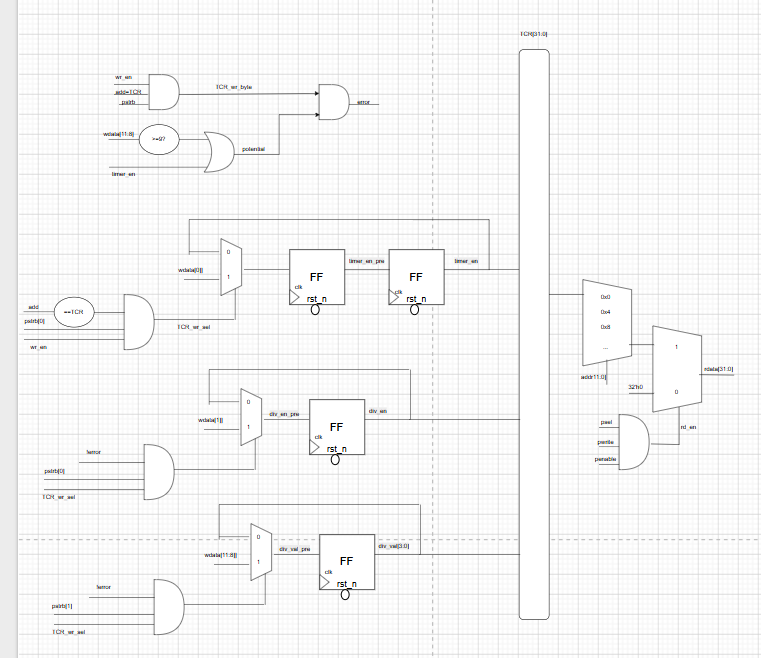 |
| Register Block (3) | 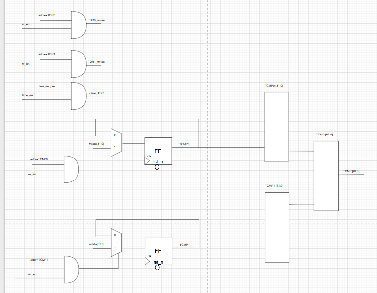 |

**Register Map (summary):**

| Offset | Name | Description |
|--------|------|-------------|
| 0x00 | CTRL | Timer control register |
| 0x04 | LOAD | Counter load value |
| 0x08 | COUNT | Current counter value (read-only) |
| 0x0C | CMP | Compare match value |
| 0x10 | INT_EN | Interrupt enable mask |
| 0x14 | INT_STATUS | Interrupt status / clear |

---

## 5. RTL Design Details

### 5.1 APB RTL

| APB View 1 | APB View 2 |
|------------|------------|
| 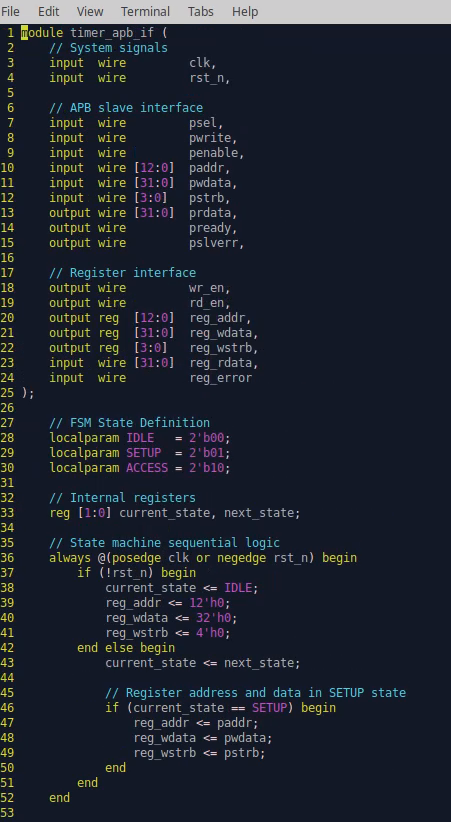 | 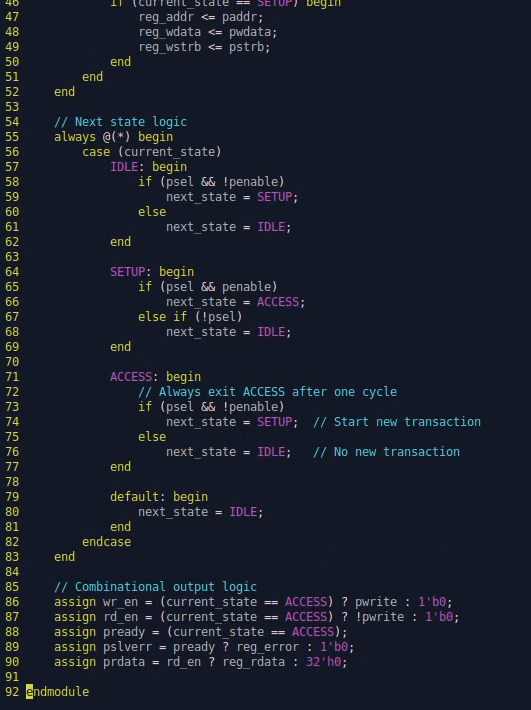 |

---

### 5.2 Counter RTL

| Counter View 1 | Counter View 2 |
|----------------|----------------|
| 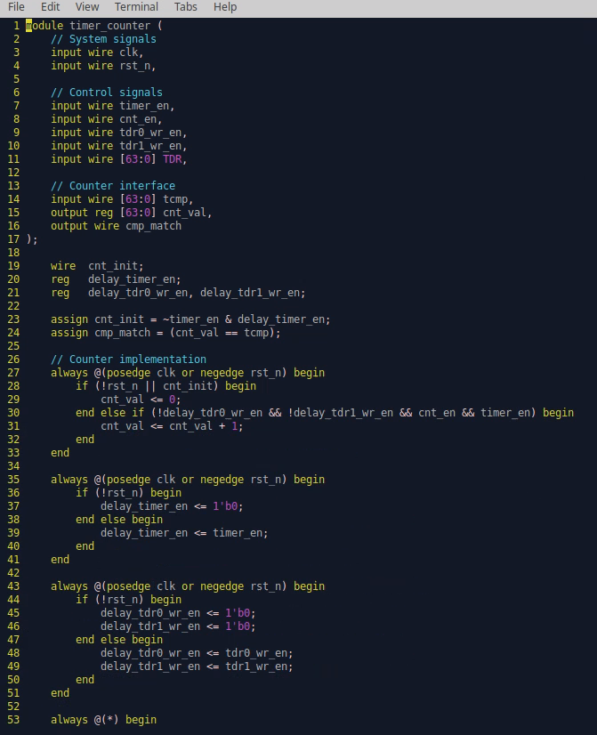 | 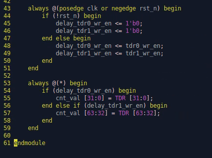 |

---

### 5.3 Control RTL

| Control View 1 | Control View 2 |
|----------------|----------------|
| 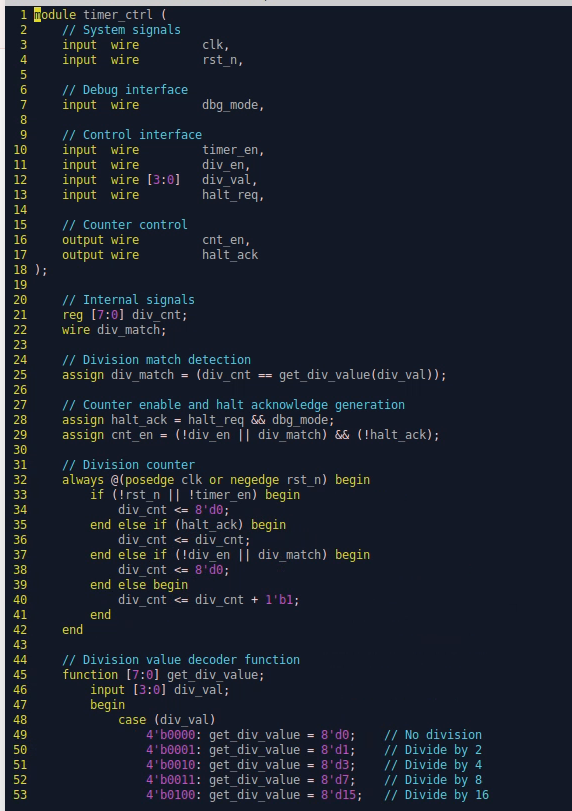 | 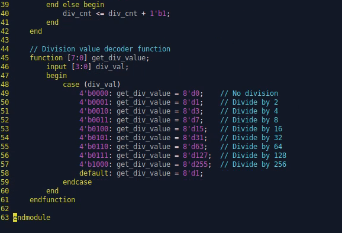 |

---

### 5.4 Register RTL

| View 1 | View 2 |
|--------|--------|
| 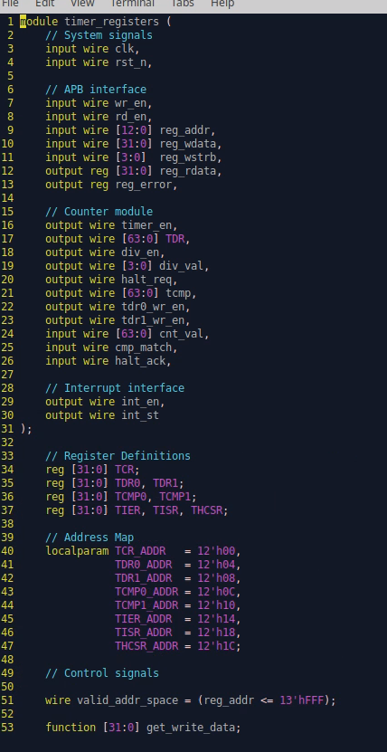 | 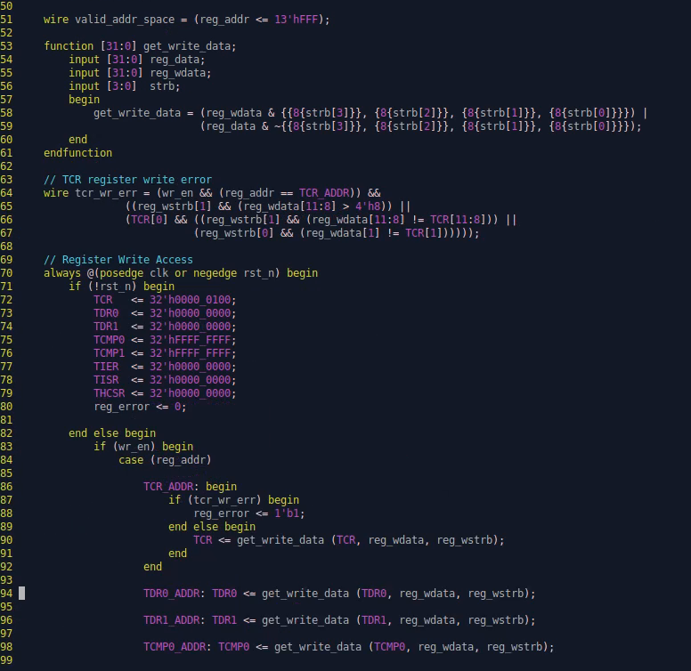 |

| View 3 | View 4 |
|--------|--------|
| 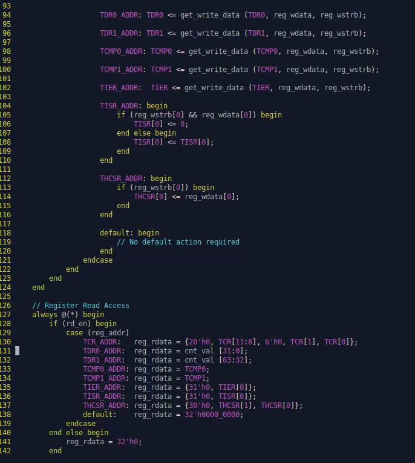 | 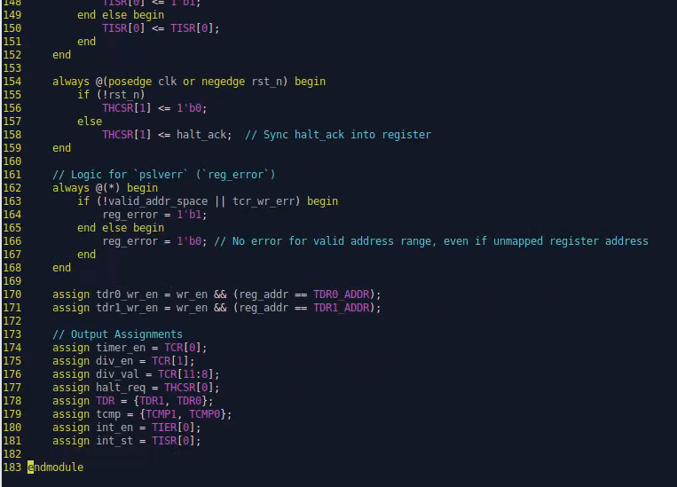 |

---

### 5.5 Interrupt RTL

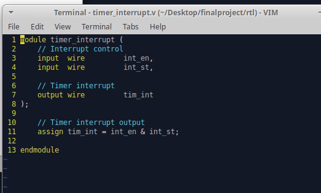

---

### 5.6 Top-Level RTL

| View 1 | View 2 | View 3 |
|--------|--------|--------|
|  |  |  |

---

## 6. Test Plan

The full test plan is documented in:

> **[Testplan (1).xlsx](Testplan%20(1).xlsx)**

Contents include:
- Test case IDs and descriptions
- Input stimulus definitions
- Expected output per test case
- Pass/Fail status
- Functional coverage metrics
- Code coverage targets

---

## 7. Simulation Results — Testcase

The `testcase/` directory contains **56 simulation waveform screenshots** captured during functional verification on 2026-01-03. Each screenshot corresponds to one or more test cases from the test plan.

**Group 1 — Basic Functionality (08:51 – 08:58)**

| # | Screenshot |
|---|------------|
| 1 |  |
| 2 |  |
| 3 |  |
| 4 |  |
| 5 |  |
| 6 |  |
| 7 |  |
| 8 |  |
| 9 |  |
| 10 |  |
| 11 |  |
| 12 |  |
| 13 |  |
| 14 |  |
| 15 |  |

**Group 2 — Counter & Control Verification (08:57 – 09:01)**

| # | Screenshot |
|---|------------|
| 16 |  |
| 17 |  |
| 18 |  |
| 19 |  |
| 20 |  |
| 21 |  |
| 22 |  |
| 23 |  |
| 24 |  |
| 25 |  |

**Group 3 — Register & Interrupt Verification (09:03 – 09:07)**

| # | Screenshot |
|---|------------|
| 26 |  |
| 27 |  |
| 28 |  |
| 29 |  |
| 30 |  |
| 31 |  |
| 32 |  |
| 33 |  |
| 34 |  |

**Group 4 — APB & Integration Tests (09:12 – 09:17)**

| # | Screenshot |
|---|------------|
| 35 |  |
| 36 |  |
| 37 |  |
| 38 |  |
| 39 |  |
| 40 |  |
| 41 |  |
| 42 |  |
| 43 |  |
| 44 |  |
| 45 |  |
| 46 |  |
| 47 |  |
| 48 |  |
| 49 |  |
| 50 |  |
| 51 |  |
| 52 |  |
| 53 |  |
| 54 |  |
| 55 |  |
| 56 |  |

---

## 8. Verification Results — Ket Qua

Final verification evidence from the `Ket qua/` directory:

### Code Coverage Report


### Simulation Output — December 2025

| Screenshot | Description |
|------------|-------------|
|  | Simulation output (Dec 3, 19:04) |
|  | Simulation output (Dec 3, 19:04) |
|  | Simulation output (Dec 3, 19:08) |
|  | Final verification run (Dec 19, 22:12) |

---

## 9. Design Specifications

| Parameter | Value |
|-----------|-------|
| Bus Protocol | APB (AMBA 2.0) |
| Design Language | Verilog / VHDL |
| Architecture | Modular, fully synthesizable |
| Interrupt Support | Yes (overflow, underflow, compare-match) |
| Timer Modes | One-shot, Free-run, PWM |
| Verification | Full functional + coverage |
| RTL Views | 14 schematic screenshots |
| Test Cases | 56 simulation screenshots |
| Coverage Evidence | Code coverage report included |
| Status | Complete |

---

*TIMER-IP — Verified and documented. All RTL views, simulation waveforms, and coverage results are included in this repository.*
