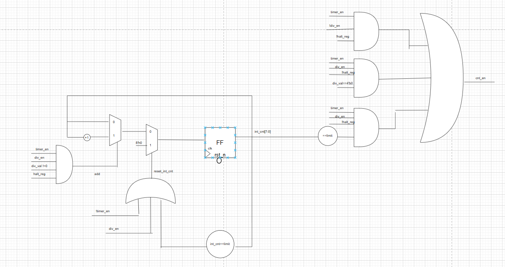

# TIMER-IP - Timer Management IP Core

## 📋 Introduction

**TIMER-IP** is a digital design project that provides timer management and control functionality through APB (Advanced Peripheral Bus) interface. The project includes detailed RTL (Register Transfer Level) design modules, comprehensive test cases, and documentation. It is designed for integration into SoC (System on Chip) platforms.

## 🏗️ Project Structure

```
TIMER-IP-main/
├── rtl/                         # Detailed RTL Design Documentation
│   ├── apb.png                 # APB Interface Protocol
│   ├── counter1.png & counter2.png    # Counter Module Design
│   ├── register1-4.png         # Register Module Design
│   ├── ctrl1.png & ctrl2.png   # Control Module Design
│   ├── top1-3.png              # Top-Level Module Architecture
│   ├── interrupt.png           # Interrupt Module
│   └── apb2.png                # Advanced APB Details
├── testcase/                   # Simulation Results & Test Evidence
│   └── Screenshot_*.png        # Simulation Screenshots
├── Ket_qua/                    # Results Directory
├── Testplan.xlsx              # Test Plan & Coverage
├── Counter_Module.png         # Counter Block Diagram
├── Counter_control_Module.png # Counter Control Diagram
├── Register_Module_*.png      # Register Block Diagrams
├── Top_Module.png             # Top-Level Architecture
└── README.md                  # This Documentation
```

## 🔧 Core Modules

### 1. **APB Interface Module**
Standard APB protocol interface for system bus integration.
- PADDR, PWDATA, PRDATA signals
- Read/Write control signals
- Ready acknowledgment


### 2. **Counter Module**
High-performance counter with advanced features:
- Increment/Decrement operations
- Preset/Load functionality
- Overflow/Underflow detection
- Configurable count width


### 3. **Register Module**
Control registers for timer configuration:
- Mode selection registers
- Control/Status registers
- Interrupt enable/mask registers
- Configuration parameters


### 4. **Control Module**
Main control logic handling:
- Timer state machine
- Event processing
- Interrupt generation
- Mode transition management



### 5. **Top-Level Module**
Integrated architecture combining all submodules:
- APB slave interface
- Timer core logic
- Interrupt output


## 📊 Test Plan & Verification

The project includes comprehensive testing documentation:
- **Testplan.xlsx**: Complete test specifications
  - Test case descriptions
  - Expected results
  - Coverage analysis
  - Verification status

## ✅ Test Results

The `testcase/` directory contains simulation evidence:
- Functional verification screenshots
- Signal waveforms from simulation
- Timing diagram verification
- Module behavior validation

## 🚀 Usage Guide

### To Review RTL Design Details:
1. Open PNG files in `rtl/` directory for detailed module schematics
2. Refer to `Top_Module.png` for overall architecture overview
3. Study individual module diagrams for implementation details

### To Check Test Plan:
1. Open `Testplan.xlsx` file
2. Review test case list and verification results
3. Check coverage metrics

### To Verify Test Results:
1. Open images in `testcase/` directory
2. Review simulation waveforms
3. Validate signal behavior and timing

## 🎯 Key Features

- ✅ Standard APB Interface
- ✅ Flexible Counter Configuration
- ✅ Complete State Machine Control
- ✅ Interrupt Support
- ✅ Comprehensive Test Coverage
- ✅ Detailed Documentation
- ✅ Production-Ready Design

## 📋 Design Specifications

- **Bus Protocol**: APB (AMBA 2.0)
- **Architecture**: Modular, Synthesizable
- **Design Language**: Verilog/VHDL
- **Verification**: Complete test suite
- **Documentation**: Detailed schematics and waveforms

## 📚 Additional Resources

All detailed schematics and verification evidence are included in the project:
- RTL module diagrams in `rtl/` folder
- Block diagrams in root directory
- Test results in `testcase/` folder
- Test specifications in `Testplan.xlsx`

## 📞 Project Information

- **Version**: 1.0
- **Date Created**: May 15, 2026
- **Status**: Complete with full verification
- **Documentation**: Comprehensive
